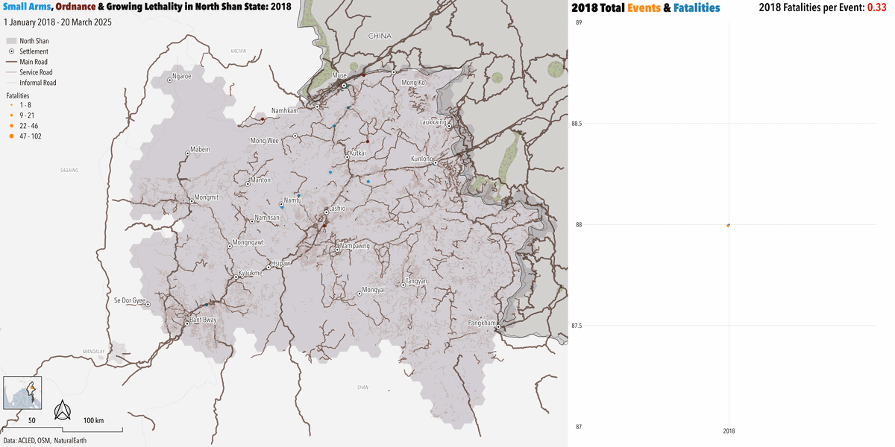
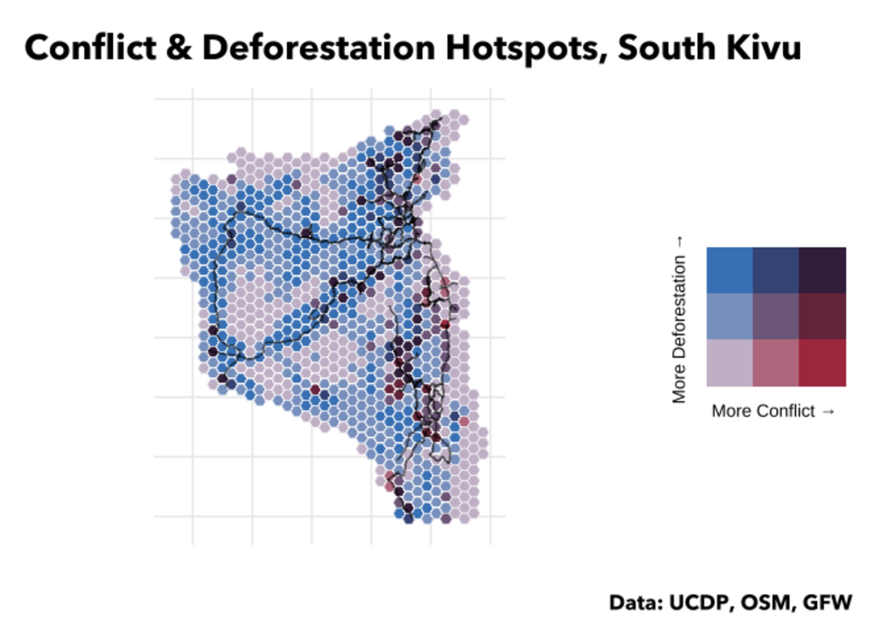
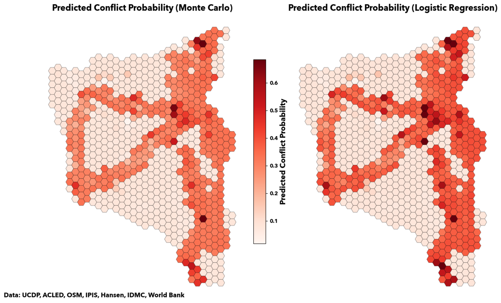
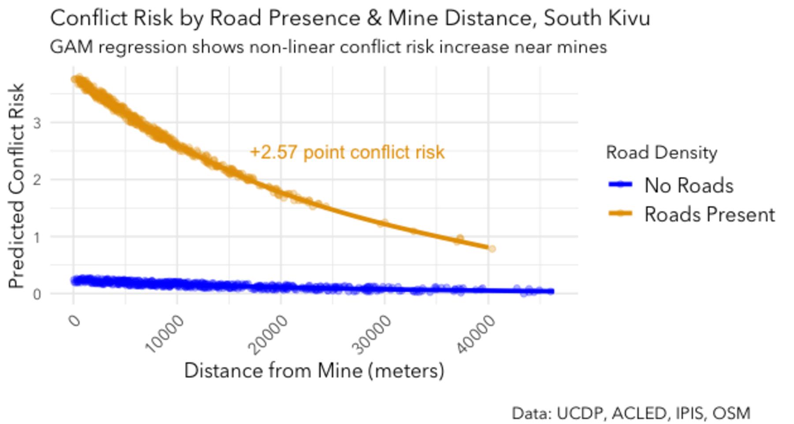

## Animated

**Does conflict track opium cultivation or transit routes? North Shan (2018–2025)** 
*Fatality-scaled hex grid animation · From: [Conflict, Opium & Territorial Control in North Shan](../papers/nshan.html)*

**Where does violence concentrate relative to infrastructure? South Kivu (2018–2024)** 
*Fatality-scaled event map · From: [Conflict, Deforestation & Mining in South Kivu](../papers/skivu.html)*

## Maps

**Where do mineral extraction sites overlap with conflict? South Kivu (2013–2024)** 
*Aggregated event density + extraction sites · From: [Conflict, Deforestation & Mining in South Kivu](../papers/skivu.html)*

**Does road proximity predict cartel violence? Michoacán & Guerrero (2018–2025)** 
*Binned proximity analysis · From: [Infrastructure of Violence in Michoacán & Guerrero](../papers/mich_guer.html)*

**How do international transit routes mediate conflict exposure? East Africa** 
*Corridor mapping · From: [Conflict, Deforestation & Mining in South Kivu](../papers/skivu.html)*

**Does deforestation co-locate with conflict intensity? South Kivu (2018–2024)** 
*Bivariate spatial analysis · From: [Conflict, Deforestation & Mining in South Kivu](../papers/skivu.html)*

## Charts

**How did conflict tactics shift after the 2021 coup? North Shan (2018–2025)** 
*Disaggregated event type over time · From: [Conflict, Opium & Territorial Control in North Shan](../papers/nshan.html)*

**Did military and opposition ordnance lethality diverge post-coup? North Shan (2022–2025)** 
*Stacked bar + fatality rate by actor · From: [Conflict, Opium & Territorial Control in North Shan](../papers/nshan.html)*

**How do cartel rivalries structure violence networks? Michoacán & Guerrero (2018–2025)** 
*Directional actor network · From: [Infrastructure of Violence in Michoacán & Guerrero](../papers/mich_guer.html)*

## Models

**How well do Monte Carlo and logistic regression predict conflict intensity? South Kivu (2018-2024)** 
*Side-by-side model comparison · From: [Conflict, Deforestation & Mining in South Kivu](../papers/skivu.html)*

**Does road proximity amplify mine proximity's effect on conflict risk? South Kivu (2018-2024)** 
*GAM interaction term · From: [Conflict, Deforestation & Mining in South Kivu](../papers/skivu.html)*

---