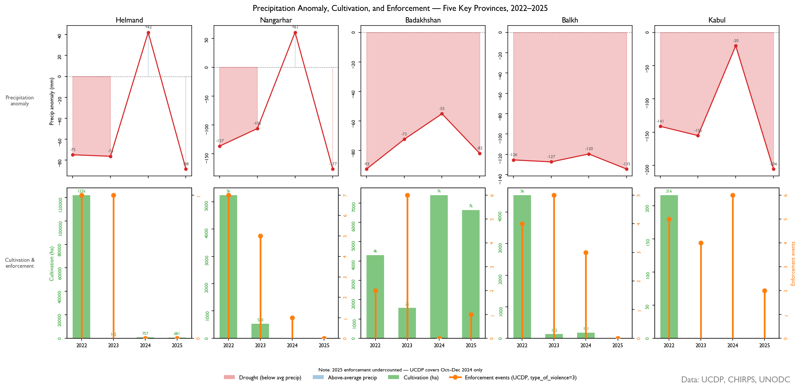
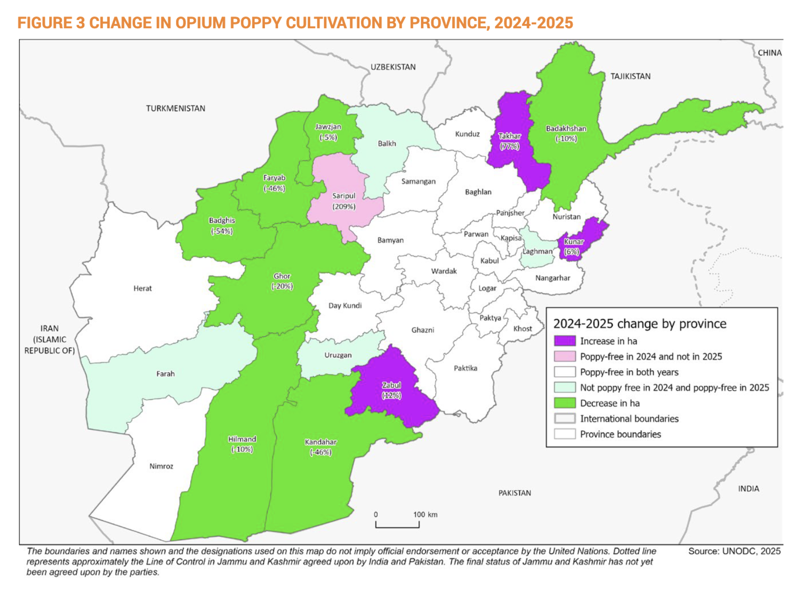

**I. Executive Summary**

Afghanistan's 2022 opium ban succeeded by every measure that matters least. A 95% decline in cultivated area over four years is the largest documented crop suppression event in modern history. This figure obscures more than it reveals. Concentrated enforcement does not reliably produce compliance, and where compliance was total, enforcement left almost no visible record.

Standard conflict datasets reflect an observable record that coercive actors actively shape. Triangulating sources with different collection mechanisms and different sensitivities to coercion– UCDP enforcement event data,[^ucdp] satellite-derived vegetation and precipitation anomalies,[^sentinel] and UNODC province-level cultivation statistics[^unodc]– sidesteps this by asking a different question: do independent sources diverge from each other in a non-random way? Systematic divergence among sources suggests active manipulation of available information. In short, the presence of coercion. 

Two divergent patterns emerge. In southern Helmand province, enforcement events lead vegetation suppression by five months. Enforcement here produces effective compliance. Cultivation collapsed to 681 ha by 2025 against a pre-ban baseline of roughly 140,000 ha.[^unodc] In northeastern Badakhshan province, where enforcements events are disproportionately high compared to compliance outcomes, this pattern inverts. Vegetation changes precede enforcement events by six months. Authorities are reacting to farmers' decisions, not the reverse. In 2025 cultivation in Badakhshan reached 6,689 ha and trended upward throughout the panel.[^unodc] Enforcement presence was too spatially fragmented relative to the province's cultivable area to produce coordinated suppression. 

This analysis implies a different picture of the ban's effectiveness than aggregate cultivation figures can provide. In cases where enforcement coherence is low, monitoring systems built on event counts risk misreading measurable activity as policy success rather than recognizing it as evidence of the opposite. Observable statistics in coercive environments are themselves shaped by the coercion. What is recorded reflects what enforcers want visible, not what is actually happening on the ground.

**II. Background**

Conventional drug crop bans define success as reducing a territory's aggregate area under cultivation. This metric treats territorial control as the primary determinant of compliance. But in areas of "limited statehood," where state sovereignty is contested and access to state institutions is locally negotiated, the relationship between control and compliance is neither direct nor uniform.[^risse][^mansfield] Aggregate statistics cannot capture this variation. National-to-provincial comparisons flatten the spatially contingent processes that actually determine a ban's effectiveness.[^mansfield] (p. 42)

The control-compliance relationship in these environments is better understood as a bargaining dynamic. Effective control is the condition under which a population judges an actor's authority sufficiently credible that compliance becomes their optimal survival strategy.[^kalyvas] (p. 168) Where control capacity is spatially uneven, that credibility threshold is never reached. Local elites remain responsive to rural economic interests over external enforcement pressure, and compliance becomes negotiated, not imposed.[^mansfield] (p. 53)

The relevant question for the Afghanistan ban is therefore not if it succeeded nationally. Instead, was enforcement coherence sufficient to meet different province-level credibility thresholds?

**III. Methodology**

Three analytical steps operationalize the divergence detection logic. First, a cultivation-precipitation baseline is established for each province using pre-ban data (2015–2021), characterizing the historical relationship between rainfall anomaly and cultivated area. Post-ban residuals– observed cultivation minus precipitation-predicted cultivation– isolate the coercive signal from climatic variation. Second, cross-correlation analysis between UCDP enforcement event counts and NDVI-derived vegetation anomalies identifies the lead/lag structure: whether enforcement activity precedes or follows cultivation change, and by how many months. A positive lag indicates enforcement is driving compliance, while a negative lag indicates authorities are reacting to cultivation decisions already made. Third, the spatial distribution of enforcement events within each province is characterized using the Clark-Evans nearest-neighbor statistic, which distinguishes clustered from dispersed enforcement presence. Clustering indicates coherent territorial coverage; dispersal indicates porous enforcement.

**IV. Helmand: Enforcement Coherence & Compliance**

Prior to the 2022 ban, Helmand province was the primary historical producer of opium in Afghanistan. After rebounding from the 2000 ban, cultivation in the province persisted through concerted eradication campaigns until 2008-9, when the Helmand Food Zone– backed by $992 million in US funding and significant armed international presence– incentivized wheat as a crop replacement strategy. In 2009, Helmand's cultivation area declined 37%.[^mansfield] (p. 230) That partial compliance under maximum international pressure sets a baseline: Helmand cultivators respond to credible enforcement, but the threshold for credibility is high. 

The key variable is not state enforcement intensity but the credibility of that state presence. Mansfield's fieldwork in central Helmand found that farmers attributed subsequent cultivation decisions not to eradication events but to whether state security infrastructure and public goods delivery were sustained.[^mansfield] (p. 258) Where presence was intermittent, enforcement was perceived as a manageable cost instead of a credible constraint, negotiable through patronage and corruption. Taliban consolidation post-2022 changed that calculus: the expected costs of evasion increased in a way episodic international enforcement was structurally unable to achieve. Helmand's lead/lag structure confirms this dynamic. Enforcement events precede vegetation suppression by five months, consistent with compliance driven by credible ongoing presence instead of reactive evasion. 

**V. Badakhshan: Enforcement Incoherence & Non-Compliance**

In contrast to Helmand, northeastern Badakhshan's experience with inconsistent, spatially fragmented enforcement highlights how bans function in areas of limited statehood. Despite periodic opium bans beginning in 1958, effective enforcement is hampered by the province's rugged Pamir geography, its porous border with Tajikistan, as well as opium's specific characteristics, including drought resistance and a high value relative to weight.[^mansfield] (p. 123-4) State capacity remains insufficient to coordinate the divergent interests of cultivators and local power brokers who profited from opium in complying with any ban. Provincial power centers with patronage ties to the opium economy remained the credible arbiters in cultivation zones.

Unique among the five provinces in the panel, Badakhshan's cultivation area has increased 86% since the 2022 ban, from 1,573 ha in its first year to 6,639 ha in 2025.[^unodc] While Badakhshan, like Helmand, has long been singled-out as a opium ban target, enforcement events in Badakhshan lag six months *behind* vegetation *growth*. The spatial dispersion of enforcement events (R = 1.28) indicates enforcement activity without *coherence*. Enforcement events averaged 40 km apart across a province that historically requires credible sustained presence in cultivation zones. This inverts the relationship found in Helmand. In Badakhshan, authorities are responding to cultivation decisions, not dictating them. 

**VI. Findings**

The two-province comparison above confirms the divergence detection logic. Where enforcement coherence was sufficient to meet the credibility threshold– Helmand– satellite-derived vegetation anomalies follow enforcement events by five months, and cultivation collapsed to near zero. Where it was not– Badakhshan– the sequence inverts. Cultivation trends upward throughout the panel regardless of enforcement event counts. The precipitation-residual baseline confirms that neither pattern is a result of climatic variation. 

Badakhshan represents a compliance failure, not a detection failure. The methodology reads the province correctly: high enforcement visibility against rising cultivation is the signal, versus a data problem. Monitoring systems that aggregate event counts without accounting for their spatial coherence will misread this as partial ban progress. The R= 1.28 dispersion statistic and negative lead/lag together identify what event counts alone cannot: enforcement presence was never dense enough to function as a credible constraint.

*Figure 1: Provincial Patterns of Precipitation, Cultivation & Enforcement: 2022-2025*

The three intermediate provinces occupy distinct positions within the bracket. Kabul matches Helmand on detection speed– 2.5σ within six months, with the panel's strongest enforcement lead correlation (r = −0.47, p = 0.011)– but its marginal pre-ban cultivation base makes it structurally the least demanding compliance case. Nangarhar presents a harder read: cultivation collapsed to zero by 2024 and a 61mm precipitation recovery that year produced no cultivation rebound. However, high pre-ban variance delays detection to 30 months and enforcement leads compliance by only one month against Helmand's five. The methodology reads both as compliance, differentiated by enforcement coherence and baseline volatility. Balkh never clears 1σ, but this is a confound problem instead of a compliance failure: persistent drought suppresses predicted cultivation so far below baseline that the enforcement residual is statistically indistinguishable from noise. In other words, compliance signal is absent because the climate model has already explained it.

*Figure 2: Province-level change in cultivation area, Afghanistan Opium Survey 2025 (UNODC)*

*UNODC's 2024–25 provincial change map codes Helmand and Badakhshan identically at –10%. The divergence detection analysis suggests these represent structurally different outcomes.*

**VII. Policy Implications**

Existing monitoring methodologies cannot differentiate variable enforcement coherence in Helmand and Badakhshan using event counts and aggregate province metrics alone. In the Afghanistan case, these two sources combine to misrepresent ground-truth reality. State presence is not generating compliance the way it does in Helmand, yet a 10% cultivation decline between 2024-25[^unodc] (see Figure 2) reads as encouraging progress in a province long outside the Taliban's effective control. Remote sensing provides the independent temporal axis that event counts cannot by distinguishing whether enforcement is driving cultivation decisions or reacting to them. Without that axis, high enforcement visibility in a low-coherence province actively masks non-compliance. 

Balkh highlights a generalizable hazard for attributing cultivation change to human activity under environmental strain. Persistent drought suppressed predicted cultivation so far below baseline that the enforcement residual became statistically indistinguishable from noise. For policymakers, this means drought-affected provinces will systematically generate false negatives in any monitoring system that doesn't first isolate the climatic signal. Before assigning compliance or non-compliance, the environmental baseline needs to be established independently.

Variable credibility thresholds across provinces require a differentiated counternarcotics enforcement architecture. Figure 2 codes Helmand and Badakhshan as trending identically at -10%. They are not the same result. In Helmand, enforcement infrastructure changed the expected cost of planting before the cultivation decision was made. In Badakhshan, enforcement investment was too spatially dispersed to function as a credible constraint on cultivation. Treating these as equivalent inputs to a national compliance figure obscures where additional enforcement pressure would change outcomes and where it would not. Where enforcement coherence is low, the observable record is not a window into compliance, only a measure of enforcement effort. 

**VIII. Method Limitations**

The five-province panel was selected to maximize cultivation baseline variance across the compliance spectrum. Whether credibility threshold variation generalizes to provinces with intermediate enforcement histories is a question the panel was not designed to answer.

The lead/lag finding in Helmand carries more inferential uncertainty than the Badakhshan result. Event-type disaggregation would distinguish whether checkpoints, active eradication, or armed encounters drove the five-month lead. This matters because the credibility threshold argument depends on enforcement presence changing cultivators' forward-looking cost calculations, not just observable evasion costs at the time of enforcement.

The methodology confirms that in Helmand enforcement precedes compliance by five months. It cannot confirm which enforcement type crossed the credibility threshold. In Badakhshan, this constraint is less consequential. The inversion is robust regardless of event type: authorities reacting to cultivation decisions already made looks the same whether those events are checkpoints or eradication operations. The sequencing is the signal. In Badakhshan, the incoherence finding is robust. What disaggregation would add is precision on its cause– whether fragmented presence reflects resource constraints, terrain, or deliberate non-enforcement.

[^sentinel]: European Space Agency. Copernicus Sentinel-2 Mission.[sentinel.esa.int](https://sentinel.esa.int/web/sentinel/missions/sentinel-2)

[^kalyvas]: Kalyvas, S. *The Logic of Violence in Civil War*.Cambridge University Press, 2006.

[^mansfield]: Mansfield, D. *A State Built on Sand: How Opium Undermined Afghanistan*.Oxford University Press, 2016.

[^risse]: Risse, T. *Governance Without a State? Policies and Politics in Areas of Limited Statehood*. Columbia University Press, 2011.

[^ucdp]: UCDP. Uppsala Conflict Data Program, Uppsala University.[ucdp.uu.se](https://ucdp.uu.se/)

[^unodc]: UNODC. *Afghanistan Opium Survey 2025*. United Nations Office on Drugs and Crime, 2025. [unodc.org](https://www.unodc.org/documents/crop-monitoring/Afghanistan/)

