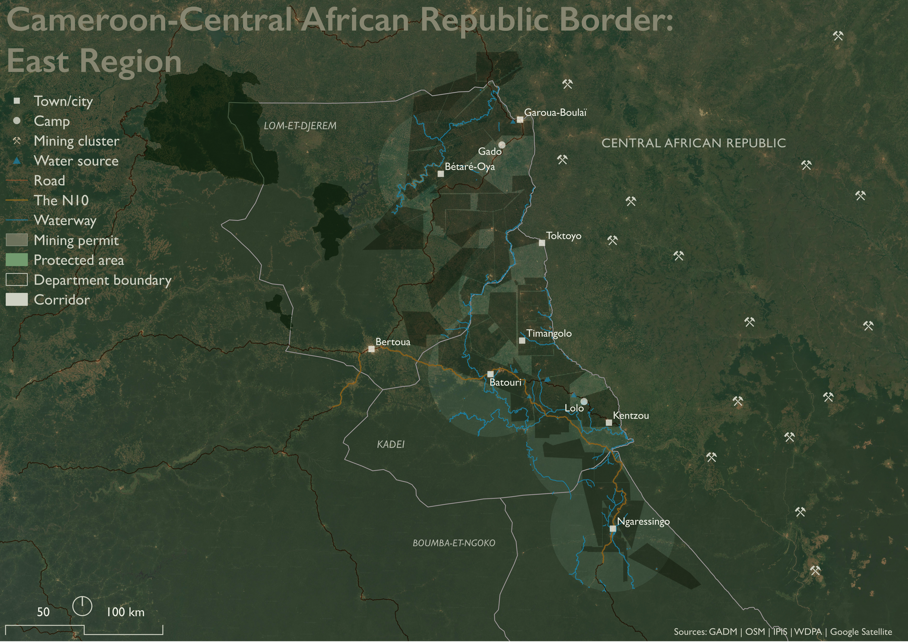
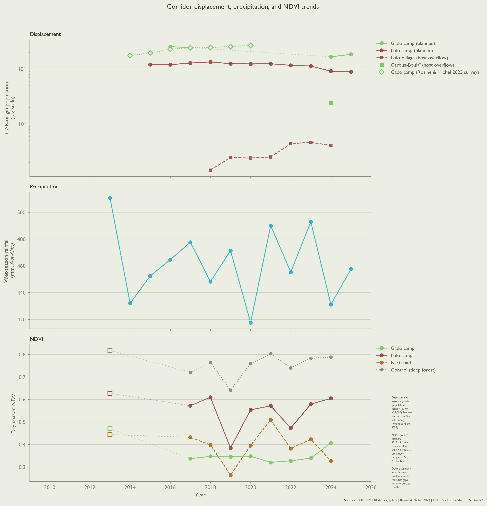
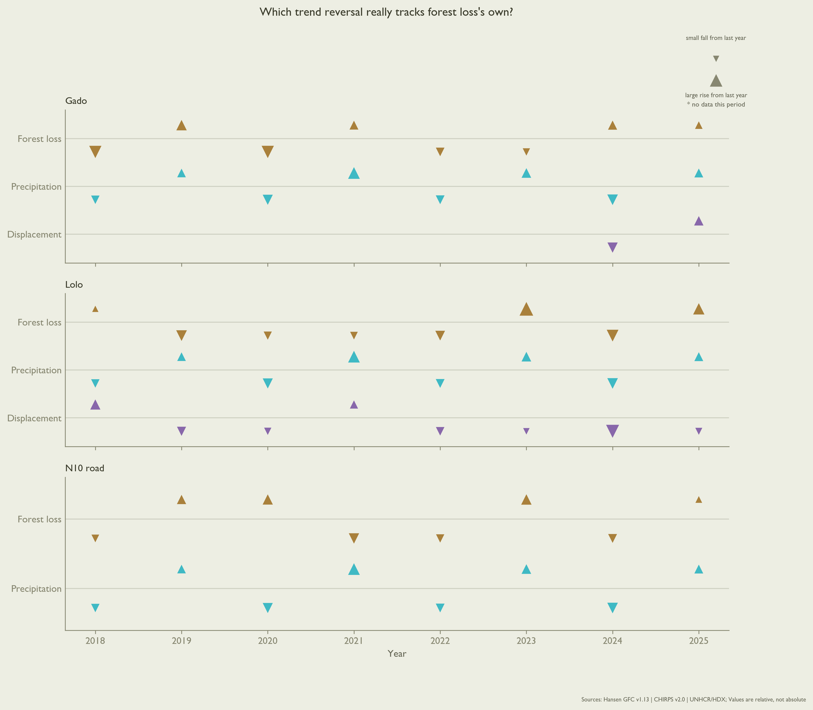
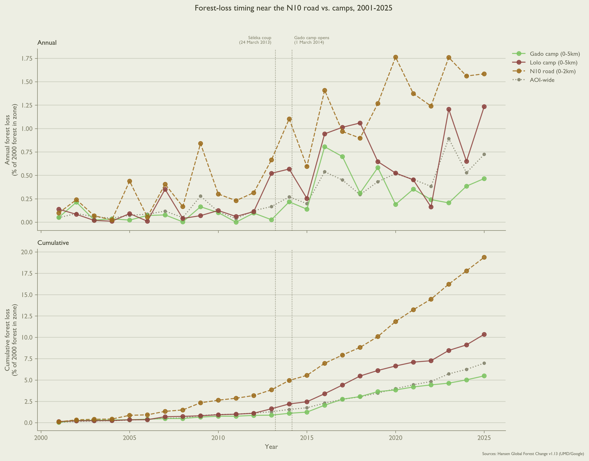
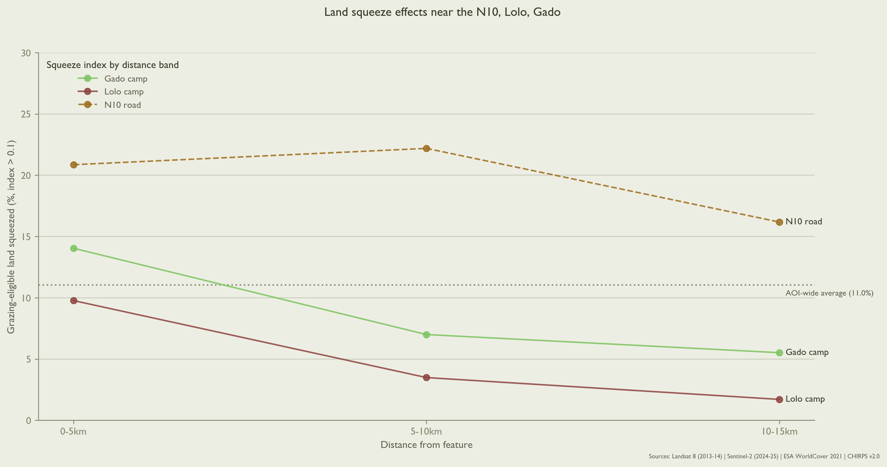

## Executive Summary

The N10 highway in Cameroon runs 329 kilometers northeast, linking the capital Yaoundé to the East Region on its Central African Republic (CAR) border. The road's last 40 kilometers intersects a north-south corridor centered on the Gado-Badzéré and Lolo refugee camps. At least 133,800 people forcibly displaced from CAR live in this borderlands corridor, nearly one-third (32.4%) of Cameroon's total. The inflow of people seeking refuge since CAR's 2014 civil war [@hrw_car] strains the corridor's water sources and grazing land. Where does this land pressure actually appear?

## Background

People have migrated to the East Region fleeing political violence in CAR since at least 1960 [@ngoune2026]. In 2013, Séléka forces carried out the fifth coup in CAR's 66-year history, deposing President François Bozizé while stimulating opposition from "anti-balaka" factions. Gado emerged in March 2014 as temporary accommodation for some 17,600 Central Africans on a 55-hectare site; Lolo, 10,000 on 60. In 2014, more than 130,000 people arrived in total across the East Region [@new_hum_2014]. In CAR, fighting between factions of primarily-Muslim Séléka and primarily-Christian anti-balaka forces persists, despite 12 years of United Nations peacekeeping operations (MINUSCA) [@minusca].

{#fig-orientation}

People living in Gado and Lolo have developed a diversified economy during their indefinite displacement. Of 220 Gado and Lolo respondents in a November 2020 survey, 67 (30.5%) reported agriculture or livestock-keeping as their primary livelihood. Another 35 (15.9%) were engaged in small trades (petits métiers), and 29 (13.2%) in commerce or trading. Eight respondents (3.6%) worked paid positions in camp health clinics or on camp committees. Cassava, the dominant crop, is increasingly processed and sold at market; likewise for cooking firewood. Whatever land and water the corridor may offer, people are already using it to get by [@tiomo_kamdem_2023].

### Environmental Precarity in the Borderlands

{#fig-context-timeseries}

Three environmental conditions make living precarious for humans in the corridor, regardless of national origin. The first is arithmetic: land readily available for concentrated human living is scarce, independent of CAR political upheaval. Over three-quarters (75.5%) of the corridor is covered in closed-canopy tropical forest. Just 5,530 km² total (23.8%) of corridor land – including grass and shrubland, built and bare land – can sustain livestock grazing, farming, and human dwelling.

Land scarcity is compounded by the second condition: eroding quality and quantity of human-useable soil. Outright land degradation (e.g., selective forest logging) does not immediately result from population growth where livable land is scarce. What population growth does stimulate is the conversion of "unused" land – fallow crop fields, seasonal pastures, and buffer spaces – into crop or built land. Usable land unused now remains *available* for use later, and so offers communities resilience, or the means for adapting to future challenges.

Since Gado and Lolo camps opened in 2014, just 1% (55.6 km²) of the corridor's human-suitable land has fully converted to crop or built use, an annual conversion rate around 0.09%. In the same time, 11% (~526 km²) of the corridor's total squeezed land – scored by year-over-year change in grass or shrub cover, vegetation greenness, and proximity to water [@lange_1969] or the N10 – has become drier or thinner or both. This "meaningfully squeezed" land outwardly appears viable for future conversion. The underlying quality of its soil – including the capacity to produce nutritious crops, to control erosion, and absorb carbon dioxide from the air – is quietly eroding eleven times faster than land is being converted.

This pattern – quiet quality loss far outpacing slow, steady conversion – complicates the intuition that climatic shocks (e.g., droughts) induce land conversion activities. The standing incentive, in population-pressured areas like the corridor, is to convert land. Whether that incentive is acted on in a given year is less a question of desperation than of labor capacity and investment logic.

The third condition is the labor and opportunity costs of fetching water. As the corridor's long dry-season deepens, water sources recede, and women and girls must walk further afield to collect water for their communities. In rural areas in Cameroon, the median walking time per trip is around 30 minutes (15 minutes each way). Each day requires four trips [@paulos_2025].

Particularly dry years mean more and longer walking for women and girls: a 10% precipitation decrease may increase weekly walk time by 21 minutes. Among other constraints, time spent walking makes their labor unavailable for clearing and planting crops. Conversely, more abundant rainfall substantively reduces walking time. A single extra centimeter of rainfall per week over a 365-day period can reduce walking time per person per trip as much as 3.5 minutes (11.6%). Sustained increases in short-term rainfall offer for families an expected return justifying the labor involved in agricultural land conversion – its clearing, planting, and tending [@paulos_2025].

Since 2018, forest-loss and precipitation trend reversals have tracked in the same direction in 6 of the last 8 years near the N10, and 5 of 8 near Lolo. This dynamic is consistent with a mechanism where precipitation enables opportunistic land conversion when rainfall is more abundant, not less.

{#fig-reversal-diagnostic}

Refugee camps are known to concentrate land degradation nearby. Elsewhere, degradation effects fall off about five kilometers from camp boundaries [@dampha_salemi_polasky_2022]. On this evidence, squeezed land in the corridor should likewise concentrate near Gado and Lolo camps. It does (see @fig-distance-decay below). The N10 road turns out to matter more.

## The N10 concentrates land degradation

Three distinct RS signals indicate land degradation disproportionately concentrates within 2 km of the N10 highway. Beginning in 2014, 2.7% of all corridor land (~627 km²) was cleared of forest. Between 500m-2 km of the N10, the forest clearing rate is 2.1 times higher, at 5.8% (~38.5 km²). When compared to other patches with elevated clearing rates – specifically those abutting rivers – the N10 clearing effect persists to 2 km, whereas elevated rates of river-driven clearing fall as distance from the river increases.

While mining permits cover 57% of corridor land, mining is barely elevated around the N10 (67.6%, 1.2x clearing rate). There is also no protected area near the N10 corridor. Since the nearest park is 62 km away, a conservation-designation explanation is unlikely.

A supplementary sweep of the N10 corridor using synthetic aperture radar (SAR; Sentinel-1, 2015-2026) [@sentinel1_sar] found no visual evidence of new roadside construction across 125 km of sampled points. While this result undercuts large-scale roadside buildup as a land degradation driver along the N10, SAR is less able to distinguish minute features, such as small-scale land conversion activities, informal storage structures, or low-density settlement.

{#fig-hansen-timeline}

Forest loss is but one of the N10's environmental consequences. 0.24% (55.7 km²) of corridor land converted from grazing-eligible to a competing use (crop, built, or bare land). One-quarter (13.9 km²) of this grazing land loss occurred within 2 km of the N10, even though this band covers just 4.2% of total corridor area. The N10 squeezes land at more than double the corridor-wide rate: 25.9% vs. 11%.

The decreasing land-squeeze at camp fringes shown in @fig-distance-decay does not mean these camp-adjacent areas are without degradation pressure. In the East Region, displaced people increasingly settle in the villages surrounding camps than in the camps themselves [@mahamat_2021]. Lolo's host village population rose 2.8 times, from 145 to 408 people between 2018-2024 [@demographics_cmr]. In 2024, 2,443 people were living in Gado's host village, six times Lolo's figure, though a single measurement.

Population growth cannot, however, explain concentrated land degradation around the N10. Between 2015-2025, population within 2 km of the N10 grew slower than the corridor average (30.6% vs. 32.2%), while population near Gado and Lolo camps grew 1.2 to 1.6 times faster [@worldpop_road]. Degradation concentrates at the road even when population does not.

{#fig-distance-decay}

## Institutional Context

In 2005, Cameroon passed a law granting forcibly displaced people similar rights as citizens, including rights to housing, economic activities, and state services [@loi_2005_006]. UNHCR-provided housing and food supplies helped CAR refugees transition as they began arriving in the East Region in 2014. Initially, these resources were open to all. In practice, international funding failed to keep pace with a rising refugee population. In response, UNHCR implemented a targeting system (ciblage) [@unhcr_targeting_2023] in camps, prioritizing food aid by household size and number of children under 5 years old [@tiomo_kamdem_2023]. Beginning in 2018, a complementary cash-transfer program has aimed to transition people ineligible for food aid under ciblage toward Cameroon's national social safety net [@unhcr_tsn_2018].

In the first quarter of 2020, for example, UNHCR reports at least 48,535 refugees from CAR accessed the cash transfer program [@unhcr_inclusion_2021]. The program was finally cut in 2025 as part of UNHCR's 30% blanket reduction in cash assistance programs [@unhcr_cash_2025]. In their 2025 Annual Report, UNHCR reports the cash transfer program ultimately reached 17% of refugees in Cameroon, compared to 83% of internally displaced people (IDPs). This gap is attributed to "funding constraints and related prioritization" [@iom_crp2025].

Whether the cash transfer program extended to people in Gado and Lolo camps remains uncorroborated in official reporting. Even a fully-funded humanitarian response could not touch change levers like land allocation, road corridors, or protected-area designation. That authority lies with Cameroonian ministries: MINDCAF (Ministry of State Property, Surveys, and Land Tenure); MINTP (Public Works); and MINEPDED (Environment, Natural Protection, and Sustainable Development).

## Policy Recommendations

Because land and soil degradation in the corridor concentrates within 2 km of the N10, effectively managing land in this buffer can yield disproportionate returns to people and environment.

### MINDCAF: Designate N10 road buffer

MINDCAF should first designate a 2 km buffer area around the corridor's stretch of the N10. By cleanly delineating the corridor's most vulnerable "squeezed" soil, this evidence-based buffer focuses subsequent policy interventions where they have highest leverage.

No new law is needed to do this. Cameroon's 1974 state-property ordinance already lets MINDCAF classify land into the public domain by decree. This classification decree itself constitutes a declaration of public utility [@ordonnance_74_2].

### MINTP: Condition N10 corridor work

Second, MINTP should attach land-use conditions to any future work on the N10 corridor itself. Since land and soil degrade disproportionately not around the camps but along the road itself, this is MINTP's purview.

Again, MINTP's legislative path already exists. Any rehabilitation, widening, or maintenance contract on this stretch already triggers a mandatory Environmental and Social Impact Assessment (EIES) under Cameroon's 1996 environmental framework law and its 2013 implementing decree [@loi_96_12_1996; @decret_eies_2013].

Rather than proposing new legislation, MINTP should write the 2 km buffer's land-use conditions into that EIES's mandatory management plan (Plan de Gestion Environnementale et Sociale) the next time MINTP commissions work in corridor.

### MINEPDED: Act within the window

Once the 2 km buffer is designated and land-use within it is conditioned, MINEPDED must finally act quickly to rejuvenate the buffer's soil. Elsewhere in Sub-Saharan Africa, labor-intensive soil-conservation techniques – pit cultivation, agroforestry, integrated soil fertility management – sustain repair at comparable degradation levels, but only when local farmers are also paid to build and maintain them [@kihara_2023]. Employing corridor residents, host and displaced alike, as the paid workforce for this kind of conservation work transforms the buffer from a government project to a source of local livelihoods.

This need not be a new line in MINEPDED's own budget. Kenya's Upper Tana-Nairobi Water Fund (UTNWF) exemplifies a local public-private model at scale. Uncontrolled surface water runoff in the Upper Tana watershed – providing water for 90% of Nairobi, some six million people – deprives soil of nutrients and smallholder farmers of their livelihoods. UTNWF helps smallholder farmers – over 260,000 in 2025 – combat this runoff by building terraces, planting trees and grasses, and maintaining these catchment ecosystems. 903 million litres of water is reclaimed annually using primarily low-technology solutions. With 118 million liters harvested from 908 water pans, for example, smallholders in the Upper Tana watershed can drip-irrigate over 6,000 additional acres of vegetable crops [@eabl_2025].

Private companies benefitting from this conservation (in the Upper Tana, beverage and power companies) directly fund the smallholder-led conservation efforts. Governed locally and independent of any ministry, UTNWF projects over USD 2 in returns for every USD 1 invested [@utnwf].

Cameroon already has the legal scaffolding for such a public-private partnership (PPP). A comparable 20-year road-infrastructure PPP – TOLLCAM's toll plazas – exist elsewhere in the country [@ppp_law_cameroon_2006; @tollcam_2022].

These three steps should be decided sequentially. MINTP has nothing to condition until MINDCAF's buffer exists, and MINEPDED has no obligated area to fund until MINTP's conditions are attached to it. Individually, each ministry already has the capacities required under existing law.

The real execution risk is coordination problems across three ministries without a standing mechanism orchestrating momentum. A light joint committee or MOU tying the buffer's designation, conditioning, and funding to the same 2 km geography and timeline would turn three recommendations into one plan.

## References

::: {#refs}
:::
