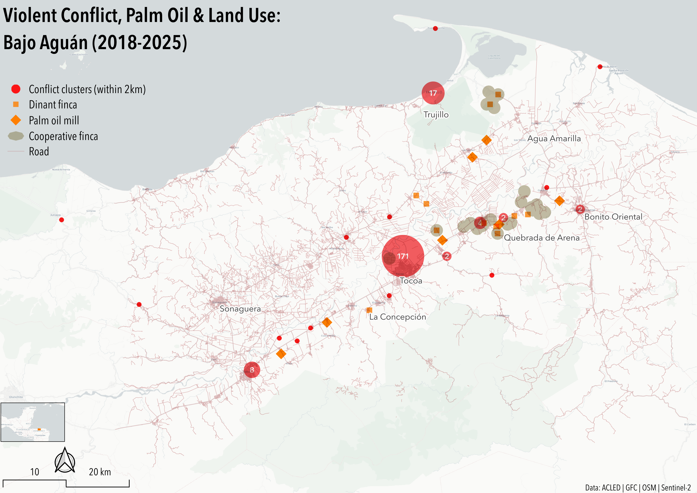
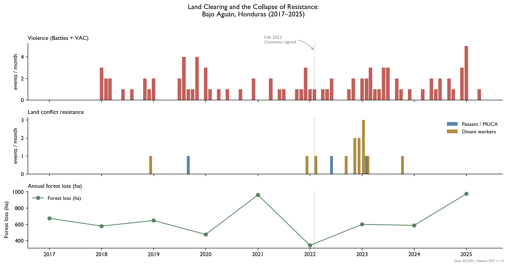
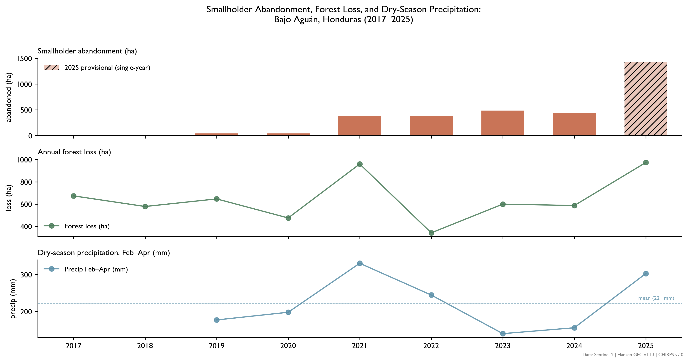

**I. Executive Summary**

In Bajo Aguán, Honduras, Corporación Dinant and its allied *terratenientes—* coordinating with complicit local and national politicians— have expropriated land designated for smallholders through systematic violence and a legal architecture designed to criminalize the rights it nominally protected.[^criterio_criminalizacion] When Honduras announced sweeping land reform policies in February 2022,[^criterio_intervencion] no mass organization occurred among the smallholders named as its principal beneficiaries. Far from indicating apathy, this silence measures the depth of coercive elite control already achieved, and its capacity to distort state reform mechanisms for its own purposes.

The coercive apparatus in Bajo Aguán operates on three levels. Physical violence has served as the baseline: over 200 targeted assassinations of cooperative workers and leaders since 2009 established the cost of organized resistance before the Convenio was signed.[^cespad_causas] As smallholder land claims increased post-2022, a second mechanism emerged— judicial inversion, in which presenting a claim under the agrarian reform framework became grounds for criminal prosecution under delito de usurpación.[^decreto_usurpacion] The case of Jaime Cabrera, coordinator for Plataforma Agraria, illustrates the inversion mechanism directly. Charged with illicit association and unlawful seizure in connection with his Convenio facilitation work, Cabrera was imprisoned November 2022–August 2023. State witnesses in the case could not identify him or any co-defendant. The third layer is enforcement timing. Attorney Lestter Castro notes that criminalizations consistently spike when cooperative organizing reaches peak capacity. In other words, leadership is targeted at the moment of its greatest political threat.[^criterio_criminalizacion] Cabrera's imprisonment began just ten months after the Convenio's signing. All three layers share a common feature. State affiliation has not deterred violence against cooperative leadership. It has identified them. The Convenio named its interlocutors. The apparatus leveraged the list.

Leveraging ACLED[^acled] event data (2018-2025), Hansen Global Forest Change[^hansen_gfc] forest loss area, and independent on-the-ground reporting,[^criterio_promesas][^cespad_fracaso] the Absent Violence method identifies two critical divergence signals in the post-Convenio period. First, observed popular resistance to ongoing land exploitation is almost nonexistent throughout the panel. Peasant and MUCA-affiliated events approach zero after 2022. The forest clearing record reanimates the interpretation. Industrial-scale forest clearing reversed a multiyear decline beginning in 2023, the first increase since 2017. Agro-industrial expansion resumed only after organized resistance had already collapsed. The clearing required only targeted enforcement. The Convenio had already done the work of identifying who needed to be removed.


*Figure 1: Violent Conflict, Palm Oil Infrastructure & Cooperative Land Presence: Bajo Aguán Valley (Jan 2018-May 2025)*



*Cluster radius proportional to event count within 2km. Corporación Dinant finca and palm oil mill locations georeferenced from CAO audit documentation and satellite imagery. Cooperative finca boundaries represent dissolved buffers around known campesino cooperative land claims. Conflict density is highest in Tocoa municipality (n=171), with secondary clustering along the Dinant operational corridor between Sonaguera and Bonito Oriental. Cooperative land presence concentrates in the Quebrada de Arena–Bonito Oriental corridor, where Dinant infrastructure and conflict events spatially overlap.*


**II. Background**

Honduras elites and international capital have long colluded to extract Bajo Aguán's land and resources. The Aguán river distributes rich volcanic soil over a humid alluvial floodplain, sustaining one of Latin America's most productive agricultural regions. 40 years after banana companies left the region, the state made Bajo Aguán a centerpiece of the 1970 Agrarian Reform Act, aimed at quelling *terrateniente* fears of more radical land expropriation. Under the Act's "colonization" policy, the state-owned Instituto Nacional Agrario offered relocated peasants credit, agricultural inputs, and price controls to produce crops through collective agricultural enterprises (*empresas campesinas*). The state funded this policy by shifting cultivation from bananas and citrus to the export-oriented oil palm. This production shift attracted International Development Bank (IDB) loans and bilateral aid, producing 500 km of roads in the Aguán valley, state-controlled African palm oil processing plants, and a seaport. New palm oil farmers received cut-rate prices from state processing plants, and the promise of future control over state-owned processing and marketing decisions. This promise was only fulfilled in 1981 after a 17-day strike. By the end of the colonization program, 409,000 hectares– 12.3% of Honduras' total area– had been redistributed to 60,000 families. But it also stimulated a persistent coercive pattern: exploiting domestic labor and resources to achieve favorable export flows abroad.[^kerssen]

The modern mechanism for private purchase of collectively-held land is the 1992 Agricultural Modernization Law (LMA; Ley para la Modernización y el Desarrollo del Sector Agrícola).[^lma] Private interests had previously expropriated collective land in Bajo Aguán using legal maneuvering, forced displacement, or corruption.[^ladb] The LMA institutionalized this pattern. By permitting *terratenientes* to expand their holdings beyond the limit defined in the 1970 agrarian reform (*sobetechos*), it stimulated the concentration of formerly-collective land among a handful of local elites. Allowing collective directors to sell collective land drove overt corruption. It also reversed the 1970 reform, which prohibited sale of collective land to private buyers. One year later, the 1993 Agricultural and Livestock Census reported that 1.6% of landowners in Bajo Aguán owned 40% of cultivated land; 72% owned 12%.[^ladb] From 1991-1993, three *terratenientes* in Bajo Aguán–  René Morales, Reinaldo Canales, and Miguel Facussé– added land from 40 collectives to their palm oil portfolios. National imports of foodstuffs increased over 16% per year from 1990-2000. Imported processed cereals replaced domestic production.[^kerssen] Amid this privatized consolidation, the Unified Movement of Aguán Peasants (MUCA)– an association of remaining collectives– was founded in 2001 to recuperate smallholder land via legal channels.[^kerssen]

By 2009, Facussé had consolidated his Corporación Dinant's position as the dominant agro-industrial actor in the valley, making it the natural vehicle for international capital seeking palm oil exposure[^ladb][^kerssen] In November 2009, the International Finance Corporation (IFC) provided Dinant a 30 million USD loan to further expand its palm oil operations in Bajo Aguán.[^ifc] Dinant's expansion targets overlapped directly with land still under cooperative claim- the same holdings MUCA had been contesting through legal channels since 2001.[^ladb][^icij] Facussé is linked to at least 88 targeted assassinations of peasants and cooperative organizers[^cespad_causas] in Aguán since the military coup he supported[^kerssen] took power in June 2009. In 2011, the IFC transferred another 70 million USD to Banco Ficohsa– Honduras' largest bank and a major Dinant partner– despite the bank's concealing allegations about Dinant's involvement in forced displacements, disappearances, and assassinations in Bajo Aguán. 

IFC's own compliance mechanism[^cao] found the bank had failed to conduct risk-commensurate due diligence, failed to disclose environmental assessments, failed to supervise security force conduct, while disbursing $15 million to Dinant inside what its own auditors called "a risk environment that had deteriorated significantly since appraisal."[^cao] The case was closed in 2018 after Dinant repaid its loan.[^cao] The third-party inquiry into rights violations by Dinant's private security forces was never completed. The enforcement architecture failed at every institutional level before it failed in Tocoa.

The 2009 coup galvanized disparate civil groups to organized resistance. MUCA began occupying Dinant-affiliated palm oil infrastructure, including 21 plantations in December 2009. These actions forced the Lobo administration to promise MUCA 11,000 hectares and service expansion in Bajo Aguán. Between the December 2009 occupation and April 2010 agreement, at least six MUCA members were assassinated.[^kerssen] Land transfers stalled as a result, while the coercive apparatus that had operated during negotiations persisted. A second wave of simultaneous land recuperations across Tocoa cooperatives and the CREM zone– documented 2017-2021– represents the last organized smallholder resistance before the Convenio window. It ended the year before the agreement was signed.[^radio_progreso]

*Figure 2: Land Clearing Resumed After Resistance Had Already Disappeared*


*Peasant/MUCA resistance events fall to near-zero following the Convenio; forest loss rebounds to 2021 peak levels by 2025.*

**III. Method**

In information environments like Bajo Aguán, aggregate statistics are vulnerable to systematic manipulation by coercive actors. Detecting this type of manipulation is possible by tracking divergences between independent data types and sources. ACLED[^acled] event data filtered to land-based violence in Bajo Aguán (2018-2025) captures overt, observed violence. Hansen Global Forest Change[^hansen_gfc] (2017-2025) measures total forest loss in the valley. Sentinel-2[^sentinel2] (2017-2025) satellite imagery proxies abandoned smallholdings (ha) by flagging smallholder-coded plots[^ndvi] with two years of sub-threshold NDVI data. CHIRPS[^chirps] (2019-2025) precipitation data isolates the role of climatic variation on land use. Independent reporting including Criterio,[^criterio_intervencion] CESPAD,[^cespad_emergencia] and Resumen Latinoamerica provides sociopolitical context.

The 2022 Convenio signing is the timeline's central discontinuity: an imposed new legal baseline against which post-Convenio behavior is measured. All three signals– violent conflict, resistance presence, and forest loss rates– are measured against a 2017-2021 pre-intervention baseline. Two divergence signals are salient. 

First, resistance event and forest loss rates test whether state enforcement commitments produced observable change. The Convenio's explicit objective– resolving violent conflict resulting from private expropriation of land meant for peasant redistribution[^criterio_dosanos]– predicts increased organized peasant presence and reduced forest loss rates, because agro-industrial penetration should fall. 

Second, the precipitation baseline controls for climatic variation, isolating abandonment trends attributable to coercive displacement, rather than drought. Dinant labor events are excluded as resistance. Worker grievances against an agro-industrial employer are a distinct signal from peasant land contestation, and conflating them inflates apparent resistance. If peasant resistance collapses and forest clearing resumes and smallholder abandonment rises independent of climate, only the coercive compliance explanation accounts for all three divergences simultaneously (see Figure 2). 


*Figure 3: Distribution of Land-Related Violent Conflict, Pre/Post-Convenio*

```{=html}
<div style="width: 100vw; position: relative; left: 50%; transform: translateX(-50%);">
<iframe src="figures/convenio_map.html" width="100%" height="560px" frameborder="0" style="border:none;"></iframe>
</div>
```
  *Pre-Convenio period is dominated by VAC concentrated in Tocoa; post-Convenio period shows shift toward battles and strategic developments, with VAC declining in absolute terms but persisting. Event counts are roughly equivalent across periods. The compositional shift, not volume reduction, is the signal.*

**IV. The Convenio window: mobilization, clearing, collapse (Jan 2022-Jan 2023)**

On 19 January 2023, Omar Cruz Tomé, president of the Los Laureles cooperative, was assassinated at his home in Tocoa. Since the beginning of the year he had received repeated death threats, reported suspected surveillance of his house, and formally requested state protection. Eight days before his murder, Cruz Tomé had filed a formal denunciation naming Los Cachos, identifying Dinant financing, and naming Mauricio Facussé as the operation's architect. The state denied his protection request and did not respond to the denunciation.[^mongabay] Cruz Tomé had been charged by Dinant with *usurpación agravada* alongside 17 co-defendants for claiming cooperative land under the agrarian reform framework. He was absolved.[^radio_progreso] Eleven months earlier, that same state had signed the Convenio para la solución del conflicto agrario– committing to protect cooperative members from forced eviction, investigate dispossession mechanisms, and establish human rights deterrence.[^cespad_emergencia][^radio_progreso]

Cruz Tomé's case was not exceptional. Plataforma Agraria recorded 12 campesino assassinations in the two years following the Convenio's signing.[^radio_progreso] Los Laureles– one of the valley's best-organized cooperatives and among its most targeted– held over 600 hectares of land that Dinant had claimed through *usurpación agravada* charges against Cruz Tomé and his co-defendants.[^radio_progreso] He was absolved. He was then killed under state protection. Forest clearing in the valley resumed its increase in 2023, the same year organized cooperative leadership was eliminated under the watch of the protection mechanism that was supposed to prevent it (see Figure 4). The Convenio's enforcement architecture could not survive contact with the entrenched interests it was designed to constrain.[^radio_progreso]


*Figure 4: Dry Years Don't Explain Rising Abandonment*


*Abandonment rises sharply from 2021 onward; 2023–2024 below-mean precipitation does not account for the abandonment trend, ruling out drought as a primary driver.*


**V. From silence to operations: Los Cachos and the limits of absent violence (Jan 2023-Feb 2025)**

On the morning of 8 December 2024, members of the Cooperativa Camarones were fencing the boundary between their land and the neighboring settlement of Quebrada de Arena when a group of armed men attacked them with machetes. Police arrived to mediate. They failed. Seventeen days later, on Christmas Eve, the same group returned with automatic weapons, surrounded the cooperative's remaining night watch, and fired until the 160 families of Camarones abandoned their land entirely.[^colombia_informa] The group called itself Los Cachos. According to denunciations filed by Plataforma Agraria and corroborated by independent reporting, Los Cachos operated under the direction of Juan Carlos Lezama with financing and logistical support from Dinant– the same agro-industrial conglomerate whose Orión Group private security forces had killed over forty cooperative members in the valley between 2009 and 2014.[^avispa_cachos][^criterio_cachos]

The pattern Plataforma Agraria documented across Camarones, Cruz Tomé's cooperative, and the ECPGC is not a series of independent failures. In each case, the mechanism of state recognition– as reform partner, as legal claimant, as precautionary measure beneficiary– proceeded and accompanied the coercive response. State recognition made resistance legible, and legibility made leadership actionable. Camarones cooperative members had been receiving threats since 2023 and were aware by that year of specific plans to expel them.[^colombia_informa] What changed in December 2024 was the transition from coercive deterrence to active territorial seizure– a shift Plataforma Agraria attributed directly to Camarones' continued occupation since April 2021 of 656 hectares claimed by Dinant.[^avispa_cachos] The basic coercive apparatus– adaptive expropriation of peasant land by elites– was not new. It was the reconstituted form of an enforcement infrastructure maintained by the valley's agro-industrial elite, in various organizational guises, since the 2009 coup. It was precisely this coercive apparatus which the Convenio, signed thirty-one months earlier, had explicitly committed to dismantle.[^cespad_comision] 

The enforcement infrastructure inherited by Los Cachos was built by Colonel Elías Melgar Urbina. Between 2009-2014, Melgar commanded the 15th Infantry Battalion. He simultaneously directed Orión, a private security firm registered to family members and contracted exclusively to Dinant.[^reporteros_melgar] Orión agents– most former military, many in uniform– patrolled Dinant plantations and road checkpoints alongside active-duty soldiers. Under Melgar, state and private security forces fused into a single coercive apparatus. Rights Action's documentation of the period describes a pattern of systematic targeted assassination: cooperative members ambushed on isolated roads, disappeared inside controlled fincas, killed without warning.[^rights_action] A World Bank internal audit concluded that violence at Dinant plantations was attributable to security forces under Dinant's control, forcing Dinant to formally disarm Orión and terminate the contract.[^cao] In an apparent show of good faith, Dinant publicized human rights trainings for its remaining guards and invited military presence on its plantations.[^mongabay] Orión the firm dissolved. Its personnel did not disperse. Its client relationship did not end. In November 2022, Dinant rearmed its guards.[^mongabay] A month later, Mauricio Esquivel, a member of El Tranvío cooperative, was found executed in Quebrada de Arena.[^cespad_pronunciamiento] The Empresa Asociativa Campesina Gregorio Chávez– founded in 2013 by peasants dispossessed by Facussé's absorption of the Plantel and Paso Aguán collectives, and led by Santos Hipólito Rivas until his assassination in February 2023— would not escape it.[^cespad_gregorio][^contracorriente_rivas]

In the twenty-three months between Cruz Tomé's assassination and the December 2024 Camarones operation, no organized resistance event was recorded in the valley. This silence is not a gap in the record. It *is* the record. The silence demonstrates coercive deterrence persisting after Cruz Tomé's murder. It confirms the underlying divergence logic established by forest clearing data in section III: resistance collapsed before clearing resumed. The apparatus did not need to act because it had already been seen to act. On 31 January 2025 in Rigores, Suyapa Guillén and José Luis Hernández were killed while driving in a truck. Both were members of Empresa Asociativa Campesina Gregorio Chávez, a COPA collective.[^contracorriente_falta] Since May 2014, this cooperative has been under IACHR precautionary measures, when the Inter-American Commission granted MC-50-14[^mc5014] in favor of 123 named members of MUCA and allied organizations following a documented pattern of killings, disappearances, and forced evictions.[^cespad_gregorio] The following day, a combined statement from peasant and human rights groups characterized the Bajo Aguán cooperatives of Camarones, El Tranvío, and El Chile as an "emergency zone," subject to attacks by armed groups "backed by guards under the authority of Dinant."[^red_defensora] Yoni Rivas, a Plataforma Agraria representative, estimated these groups' strength at around 60 individuals.[^contracorriente_falta] Despite substantial security presence including armed personnel carriers, the state failed to respond.[^contracorriente_falta] Six weeks earlier, the IACHR had visited Tocoa, meeting directly with MC-50-14 beneficiaries and urging the state to strengthen compliance mechanisms.[^iachr_visit_2024] The visit established MC-50-14 beneficiaries as a named, state-verified population. Six weeks later, two of them were dead.

The cases of Jaime Cabrera, Omar Cruz Tomé, Hipólito Rivas, Suyapa Guillén, and José Luis Hernández are not independent. Cabrera was imprisoned while serving as the Convenio's named institutional interlocutor. Cruz Tomé was killed while his *usurpación* charges remained pending, a Convenio claimant under nominal state protection. Guillén and Hernández were killed in a zone the state knew was under armed group control, two months after the IACHR delegation visited Tocoa to assess compliance with precautionary measures including MC-50-14. This pattern is not protection failure. It is the targeting-index logic announced at Camarones, running forward. The 160 families in Camarones abandoned their land without any external recognition. In October 2025, 170 members of the Camarones, El Tranvío, and El Chile cooperatives marched from Tocoa to Tegucigalpa to protest continued violence by Los Cachos.[^criterio_corte] Camarones remains displaced. The targeting-index logic documented here does not stop at the cooperatives already named. It extends to every organization that makes itself legible to the state in claiming protection or pursuing policy goals. 

**VI. Policy Recommendations**

For advocates operating in environments like Bajo Aguán, the targeting index mechanism significantly complicates organizing efforts through official channels. Formal registration, identifiable acts of denunciation, and precautionary measure enrollment have not functioned as effective protection strategies: they serve to make resistance legible for the coercive apparatus. Advocacy strategies leveraging state recognition as a tactic need to account for this increased risk profile. Wherever possible, organizational strategies that avoid formal registration requirements– via horizontal documentation networks, unregistered solidarity structures, or international accompaniment– reduce the legibility that state engagement creates without sacrificing coordination capacity.

*IFC/CAO:*

In October 2024, a Delaware court approved a 5 million USD settlement between the IFC and 13 anonymous plaintiffs from Bajo Aguán, for violence perpetrated by Dinant security forces.[^mongabay] The IFC settled without admitting liability. The third-party inquiry into Dinant's security wing, ordered as part of the original 2013 CAO audit, was never completed. The Orión-to-Los Cachos lineage documented above constitutes evidence of agro-industrial remobilization post-audit. EarthRights International, which litigated the Delaware case, represents the most viable international legal avenue for advocates seeking independent accountability outside Honduran state institutions. The international paper trail is public record. The IFC's "absolute immunity," at least for cases originating in the US, is removed.[^mongabay] The inquiry into the reconstituted coercive apparatus in Bajo Aguán remains open.

*Los Cachos/Lezama:*

Plataforma Agraria has already filed denunciations naming Juan Carlos Lezama as leader of Los Cachos and identifying its Dinant financing sources. While this evidentiary link exists, domestic criminal prosecution has not proven a viable path for holding these actors to account. The risk of judicial inversion– where plaintiffs are themselves criminally charged– is documented. The state's non-response to the February 2025 emergency declaration and the December 2025 failed eviction of Los Cachos confirms its lack of political will to monopolize force in fulfilling its commitments to ending violence. The November 2024 IACHR visit, followed six weeks later by the Christmas Eve displacement and two months later by the Rigores killings, documents the gap between stated commitment and operational reality. This gap is arguable before inter-American mechanisms without requiring Honduran state cooperation.

*On the State's Own Record:*

The Comisión de Seguridad Agraria was constituted in June 2023 excluding human rights institutions from its composition. In its first year it oversaw 27 violent evictions.[^cespad_comision] This record is not an argument for reforming the Comisión. It is evidence that the state's agrarian security apparatus has functioned as an enforcement mechanism for displacement rather than against it. Like the CAO audit and MC-50-14, the Comisión's eviction record is obligated self-documentation. Advocates should leverage this documentation as evidence for inter-American accountability organs that operate outside Honduran state jurisdiction. Taken together, these three records– IFC non-compliance, a decade of unimplemented precautionary measures, and 27 state-supervised evictions in the Comisión's first year– document a structural enforcement failure unexplainable by incapacity alone.

[^acled]: Armed Conflict Location & Event Data Project (ACLED).
*Americas Dataset 2018–2025.* Accessed June 2026.
https://acleddata.com

[^hansen_gfc]: Hansen, M. C., P. V. Potapov, R. Moore, M. Hancher,
S. A. Turubanova, A. Tyukavina, D. Thau, S. V. Stehman, S. J. Goetz,
T. R. Loveland, A. Kommareddy, A. Egorov, L. Chini, C. O. Justice,
and J. R. G. Townshend. 2013. "High-Resolution Global Maps of
21st-Century Forest Cover Change." *Science* 342: 850–53. Dataset:
UMD/hansen/global_forest_change_2023_v1_11, accessed via Google
Earth Engine, June 2026.

[^chirps]: Funk, Chris, et al. "The Climate Hazards Infrared
Precipitation with Stations — A New Environmental Record for
Monitoring Extremes." *Scientific Data* 2, 150066.
doi:10.1038/sdata.2015.66, 2015.

[^sentinel2]: European Space Agency. *Copernicus Sentinel-2 Surface
Reflectance Harmonized (S2_SR_HARMONIZED).* Accessed via Google
Earth Engine, June 2026.
https://developers.google.com/earth-engine/datasets/catalog/COPERNICUS_S2_SR_HARMONIZED

[^ndvi]: Smallholder plots defined as parcels with two consecutive
years of sub-threshold NDVI data (NDVI < 0.6, coefficient of
variance < 0.15), derived from Sentinel-2 surface reflectance imagery.

[^kerssen]: Kerssen, T.M. *Grabbing Power: The New Struggles for Land,
Food and Democracy in Northern Honduras.* Food First Books, 2013.

[^lma]: Honduras. *Ley para la Modernización y el Desarrollo del Sector
Agrícola.* Decreto 31-92, 1992.
https://www.tsc.gob.hn/biblioteca/index.php/leyes/134-ley-para-la-modernizacion-y-el-desarrollo-del-sector-agricola

[^decreto_usurpacion]: Honduras. *Código Penal, Decreto 93-2021*
(usurpación agravada provisions).
https://criterio.hn/wp-content/uploads/2022/09/Decreto_93-2021-Codigo-Penal-4.pdf

[^ladb]: Latin America Data Base / NotiCen. University of New Mexico
Digital Repository.
https://digitalrepository.unm.edu/cgi/viewcontent.cgi?article=10928&context=noticen

[^ifc]: International Finance Corporation. "Update Regarding IFC's
Asset Management Company." 2023.
https://www.ifc.org/en/statements/2023/update-regarding-ifc-s-asset-management-company

[^cao]: IFC Compliance Advisor Ombudsman. *Assessment Report:
IFC Investment in Corporación Dinant, Honduras.* CAO Vice President
Request.
https://www.cao-ombudsman.org/cases/honduras-dinant-01cao-vice-president-request

[^icij]: International Consortium of Investigative Journalists.
"Bathed in Blood: World Bank Arm Gave Loan Amid Deadly Land War."
https://www.icij.org/investigations/world-bank/bathed-blood-world-bank-arm-gave-loan-amid-deadly-land-war/

[^mongabay]: Mongabay. "World Bank's IFC Must Pay Reparations to
Honduran Farmers, US Court Rules." October 2024.
https://news.mongabay.com/2024/10/world-banks-ifc-must-pay-reparations-to-honduran-farmers-us-court-rules/

[^rights_action]: Bird, Annie. *Human Rights Violations Attributed to
Military Forces in the Bajo Aguán Valley.* Rights Action, February 2013.
https://static1.squarespace.com/static/5e333dd15d21eb4f38e57e9d/t/63daee9866287e690e38d508/1675292313060/13-02.Rp-Aguan-HRviolations.Art-AB.pdf

[^mc5014]: Inter-American Commission on Human Rights. *Precautionary
Measure MC-50-14: Members of MUCA and Allied Cooperatives, Honduras.*
May 2014.
https://www.oas.org/es/cidh/decisiones/pdf/2014/mc50-14-es.pdf

[^iachr_visit_2024]: Inter-American Commission on Human Rights.
"IACHR Concludes Visit to Honduras." Press Release, November 2024.
https://www.oas.org/en/iachr/jsForm/?File=/en/iachr/media_center/preleases/2024/285.asp

[^radio_progreso]: Radio Progreso Honduras. "Comisión tripartita: un
paso hacia la resolución de la crisis en el Valle del Aguán."
https://www.radioprogresohn.net/noticias-nacionales/comision-tripartita-un-paso-hacia-la-resolucion-de-la-crisis-en-el-valle-del-aguan/

[^criterio_dosanos]: Criterio.hn. "Aguán: Dos años sin soluciones tras
convenio agrario firmado con el gobierno." July 23, 2024.
https://criterio.hn/aguan-dos-anos-sin-soluciones-tras-convenio-agrario-firmado-con-el-gobierno/

[^criterio_criminalizacion]: Criterio.hn. "Criminalización, un eslabón
en la cadena de violencia en el Valle del Aguán." October 10, 2023.
https://criterio.hn/criminalizacion-un-eslabon-en-la-cadena-de-violencia-en-el-valle-del-aguan/

[^criterio_intervencion]: Criterio.hn. "Tras dos meses de violencia en
el Bajo Aguán, ordenan intervención militar y policial."
February 11, 2025.
https://criterio.hn/tras-dos-meses-de-violencia-en-el-bajo-aguan-ordenan-intervencion-militar-y-policial/

[^criterio_promesas]: Criterio.hn. "Campesinos e indígenas exigen a
Xiomara Castro cumplir promesas agrarias." September 26, 2024.
https://criterio.hn/campesinos-e-indigenas-exigen-a-xiomara-castro-cumplir-promesas-agrarias/

[^criterio_cachos]: Criterio.hn. "Tocoa: 25 campesinos heridos en
plantón pacífico mientras exigían desarticulación de 'Los Cachos'."
January 7, 2025.
https://criterio.hn/tocoa-25-campesinos-heridos-en-planton-pacifico-mientras-exigian-desarticulacion-de-los-cachos/

[^criterio_corte]: Criterio.hn. "Campesinos del Bajo Aguán acampan
frente a la Corte Suprema exigiendo desalojo de Los Cachos."
October 2025.
https://criterio.hn/campesinos-del-bajo-aguan-acampan-frente-a-la-corte-suprema-exigiendo-desalojo-de-los-cachos/

[^cespad_causas]: Centro de Estudios para la Democracia (CESPAD).
"Conflicto agrario en el Aguán: causas estructurales, características
de la disputa social y nuevo enfoque para una salida democrática."
September 2023.
https://cespad.org.hn/wp-content/uploads/2023/11/Conflicto-Agrario-en-el-Aguan-WEB-1_compressed.pdf

[^cespad_comision]: Centro de Estudios para la Democracia (CESPAD).
"Balance sobre el primer año de gestión de la Comisión de Seguridad
Agraria y Acceso a la Tierra en Honduras." June 10, 2024.
https://cespad.org.hn/analisis-semanal-balance-sobre-el-primer-ano-de-gestion-de-la-comision-de-seguridad-agraria-y-acceso-a-la-tierra-en-honduras/

[^cespad_gregorio]: Centro de Estudios para la Democracia (CESPAD).
"Sin respuesta estatal: la violencia histórica de los campesinos y
campesinas de la Gregorio Chávez." 2025.
https://cespad.org.hn/sin-respuesta-estatal-la-violencia-historica-de-los-campesinos-y-campesinas-de-la-gregorio-chavez/

[^cespad_emergencia]: Centro de Estudios para la Democracia (CESPAD).
"El Bajo Aguán y una declaratoria de emergencia que el gobierno de
Castro desatiende." February 5, 2025.
https://cespad.org.hn/el-bajo-aguan-y-una-declaratoria-de-emergencia-que-el-gobierno-de-castro-desatiende/

[^cespad_fracaso]: Centro de Estudios para la Democracia (CESPAD).
"El Bajo Aguán, la radiografía del fracaso de la institucionalidad de
derechos humanos en Honduras." February 11, 2025.
https://cespad.org.hn/analisis-semanal-el-bajo-aguan-la-radiografia-del-fracaso-de-la-institucionalidad-de-derechos-humanos-en-honduras/

[^cespad_pronunciamiento]: Centro de Estudios para la Democracia
(CESPAD). "Pronunciamiento sobre conflictividad en Colón." January 2023.
https://cespad.org.hn/wp-content/uploads/2023/01/Pronunciamiento-conflictividad-en-Colon.pdf

[^avispa_cachos]: Avispa Midia. "Ataque armado en Bajo Aguán, Honduras,
impide retorno de familias campesinas." December 10, 2025.
https://avispa.org/ataque-armado-en-bajo-aguan-honduras-impide-retorno-de-familias-campesinas/

[^reporteros_melgar]: Funes, Wendy, and Jared Olson.
"Narcomilitarismo: Los escuadrones de la muerte en el Bajo Aguán."
Reporteros de Investigación / Expediente Público, December 15, 2023.
https://reporterosdeinvestigacion.com/2023/12/15/narcomilitarismo-los-escuadrones-de-la-muerte-en-el-bajo-aguan/

[^contracorriente_falta]: Contracorriente. "Falta de acción estatal
profundiza crisis en el Bajo Aguán mientras la violencia deja muertos
y heridos." February 4, 2025.
https://contracorriente.red/2025/02/04/falta-de-accion-estatal-profundiza-crisis-en-el-bajo-aguan-mientras-la-violencia-deja-muertos-y-heridos/

[^contracorriente_rivas]: Contracorriente. "El asesinato de Santos
Rivas y su hijo sigue impune tres años después en el Bajo Aguán."
March 16, 2026.
https://contracorriente.red/2026/03/16/el-asesinato-de-santos-rivas-y-su-hijo-sigue-impune-tres-anos-despues-en-el-bajo-aguan/

[^colombia_informa]: Mangrane, Luis. "Los Cachos despojan y desplazan
a una cooperativa en el Bajo Aguán, Honduras." Colombia Informa, 2025.
https://www.colombiainforma.info/los-cachos-despojan-y-desplazan-a-una-cooperativa-en-el-bajo-aguan-honduras/

[^red_defensora]: Red Nacional de Defensoras de Derechos Humanos en
Honduras (@RedDefensoras). Statement on Bajo Aguán emergency
declaration. February 2025.
https://x.com/RedDefensoras/status/1885697711015411760/photo/1