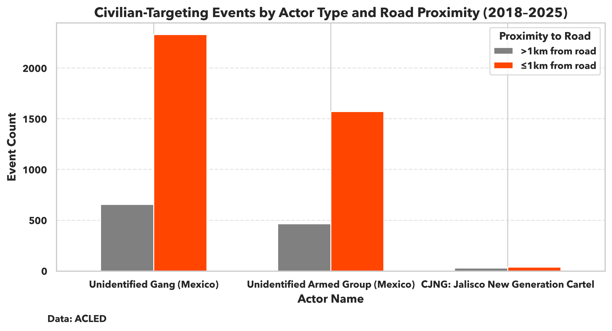
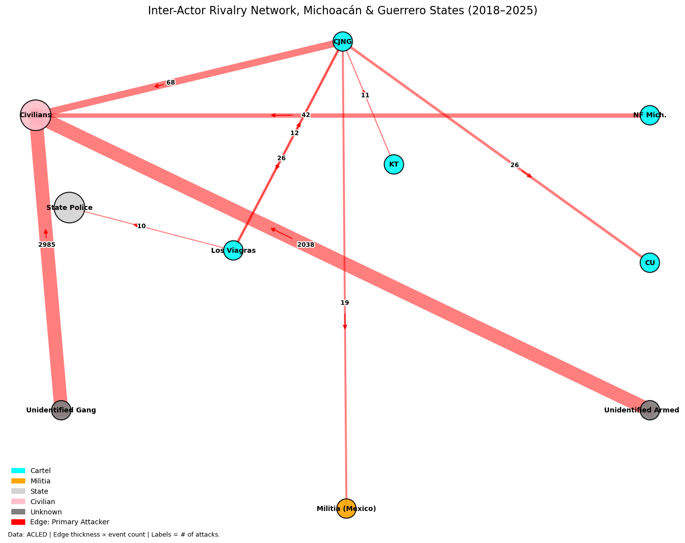

**I. Executive Summary**

On 15 May 2025, in Acapulco de Juárez, Guerrero, unidentified gunmen shot and killed[^1] José Carlos González, a local journalist who managed a Facebook page documenting municipal corruption and abuses of state power. The victim, previously targeted for death in 2023, wore a mask in public for fear of reprisal. His murder, carried out in Acapulco’s city center near Federal Highway MEX 95D, reflects a striking broader pattern: in Michoacán and Guerrero, specific federal road corridors have emerged as consistent hotspots for civilian targeting by armed groups.

Roads like the one where González was killed have long held strategic value in Mexico’s conflict ecosystem. For powerful cartels, federal highways are essential arteries in transnational trafficking routes, linking rural production zones, ports, and border crossings into coherent supply chains. For smaller, less structured armed groups, these roads offer more immediate payoffs: dense, target-rich zones  where they can extract short-term rents, assert territorial presence, and exploit civilians with minimal interference.

To better understand the interplay of violence and infrastructure proximity, this analysis combines over 15,000 conflict events from ACLED (2018–2025) with federal road networks in Michoacán and Guerrero. Spatial clustering reveals three specific corridors where risk of violence is systemically elevated: Carretera Cuernavaca-Chilpancingo on MEX 93D near Chilpancingo, Avenida Cuauhtémoc feeding into MEX 93D near Acapulco, and Calle Periférico Sur on MEX 51 near Taxco. Conflict events within 1km of these road sections occur nearly five times more often than in other areas. 

While proximity to roads alone does not explain all variation in conflict (as indicated by a low R² value in regression analysis), these corridors concentrate a disproportionate share of violence, particularly from unidentified armed groups and gangs.[^2] These actors, distinct from major cartels, inordinately target civilians and operate in fragmented, low-governance environments near infrastructure: areas they perceive as high-return targets and where even less-capable groups can assert control and extract gains. 

These unidentified armed groups include *huachicoleros[^3]–* fuel thieves whose objectives inherently depend on proximity to infrastructure. Unlike other groups, their targeting patterns may reflect logistical opportunism rather than territorial control or civilian suppression.

The roads exploited by these smaller groups serve as tactical chokepoints[^4] shaped by economic exigencies– such as the need[^5] to move agricultural products quickly– rugged[^6] terrain, and a history of incendiary[^7] state interventions. For armed groups unable to dominate transnational drug routes, the same connective spaces that civilians depend on public infrastructure for daily routines also expose local populations to persistently high levels of risk.

**II. Actor Typology & Targeting Behavior**

Importantly, violence along these corridors cannot be explained by local socioeconomic conditions or by the value of regional crops– including Michoacán’s nearly $3 billion[^8] avocado industry.[^9] Areas with high avocado production or marginalization levels do not consistently correspond with elevated conflict. Instead, proximity to federal roads- especially those near land and maritime transit hubs– emerges as the most reliable spatial predictor of violence. These highways serve as both logistical nodes and lucrative revenue streams, particularly along trafficking routes and coastal corridors tied to fentanyl[^10] and  other synthetic[^11] drug flows.

*Figure 1: Federal Highway Proximity & Cartel Conflict Intensity in Michoacán and Guerrero (2018–2025)*

*Clusters of elevated violence align with chokepoint corridors such as MEX 93D in Acapulco and Chilpancingo, MEX 15 from Zamora to Morelia, and MEX 51 near Taxco.*

Figure 1 highlights the different logics used by armed groups in Michoacán and Guerrero, highlighting both operational capacity and strategic aims. In Guerrero, conflict events cluster tightly along federal highways exploited by fragmented actors seeking to control chokepoints and extract rents. These chokepoints– often narrow road corridors or transit junctions– are strategic because they concentrate civilian and commercial movement into predictable spaces. While they are especially attractive to lower-capacity groups, asserting control over them still requires a minimal level of coordination, firepower, or intimidation. This makes chokepoints ideal targets for actors who lack the resources to hold[^12] territory but possess just enough capacity to project power intermittently and extract value from state infrastructure.

*Figure 2: Civilian-Targeting Events by Actor Type and Road Proximity (2018–2025)* 

*Unidentified Armed Groups and Gangs commit the vast majority of civilian-targeting events near federal roads. Over 90% of their attacks occur within 1km of highways.*

Conversely, Michoacán experiences a wider-ranging  pattern of violence, particularly in the western Tierra Caliente, where conflict density remains high even far from major roads. This suggests that violence there stems not only from mobility-enabled targeting but from sustained territorial contestation by larger, more organized groups. These actors seek control over resource-rich zones– including[^5] major avocado-producing municipalities– and attempt[^13] to steer local governance. While Guerrero’s violence may respond to chokepoint-focused interventions, Michoacán’s dynamics reflect entrenched armed governance and require deeper, systemic state re-engagement to dismantle these structures and reassert legitimate authority.

Figure 2 underscores this distinction. It shows that over 90% of civilian-targeting attacks by Unidentified Armed Groups and Gangs occur within 1km of federal roads, reinforcing the idea that Guerrero’s violence is driven by opportunistic actors leveraging chokepoints. While these groups lack the capacity to hold large areas, they can still project coercive power over key infrastructure with limited resources. 

Roads like MEX 93D serve not only as trafficking corridors but also as routinized channels where civilians– forced to use state infrastructure to work, travel, or trade– endure heightened exposure to extortion, ambush, and assault. In areas with weak institutional presence, chokepoints become perilous not because they are manageable, but because their predictability enables fragmented actors to exert pressure and carry out coercive actions with minimal effort and maximal tactical payoff. 

**III. Actor Interactions & Tactical Economies**

While some municipalities reflect conflict dynamics on the high-capacity end of the criminal spectrum, much of the surrounding violence is driven by less-organized groups operating in low-governance zones. These actors rarely engage state forces or rival cartels, relying instead on opportunistic violence against civilians to assert presence and gain territorial purchase. The network analysis below shows that Unidentified Armed Groups and Gangs are responsible for the overwhelming share of civilian-directed attacks across Michoacán and Guerrero.

As shown in Figure 3, these actors were responsible for over 97% of civilian-directed violence between 2018–2025– consistent[^14] with low-capacity tactics in accessible, high-traffic areas. In contrast, larger cartels such as CJNG and Los Viagras are more likely to confront one another or state forces directly, reflecting more organized and resource-intensive modes of conflict. This distinction reinforces the spatial trends observed in Guerrero: violence along road corridors is not merely a function of infrastructure, but of actor type and the tactical logic of groups exploiting chokepoints without needing to hold territory. 

*Figure 3: Directed network graph of armed actor interactions in Michoacán and Guerrero (2018–2025)*

*Node size corresponds to attack frequency; edge width reflects the number of events initiated by the source node. Unidentified Armed Groups and Gangs account for over 97% of civilian-targeting events, rarely engaging state forces or rival cartels– highlighting their opportunistic use of contested infrastructure and avoidance of high-capacity confrontation.*

**IV. Policy Implications** 

The spatial and actor-based distinctions in violence patterns underscores the need for geographically differentiated strategies. In Guerrero, where violence clusters tightly along road corridors and is primarily driven by low-capacity, unidentified actors, interventions must address the opportunistic nature of conflict. Violence here is shaped less by long-term territorial ambition than by short-term extractive actions made possible by weak institutional presence. Enhancing routine or community highway monitoring, increasing civilian patrol visibility, and visibly fortifying key chokepoints could help disrupt patterns of ambush, extortion, and civilian targeting that flourish in these permissive environments. 

In contrast, Michoacán faces a different challenge: sustained, strategic violence carried out by entrenched cartels with the capacity and intent to impose territorial governance. These actors engage in calculated campaigns against rivals and state forces alike, often seeking control over high-value resource zones and critical infrastructure. In these contexts, tactical enforcement alone is insufficient. Restoring political legitimacy in Michoacán will require rebuilding rural administrative capacity, dismantling parallel governance structures, and expanding the reach of public services into areas long[^14] dominated by armed control. 

Broadening the scope of responses to include non-military approaches is essential to meaningfully address the systemic drivers of cartel recruitment and to place this threat to Mexico’s social, economic, and political stability in proper context. One recent model suggests[^15] that cutting recruitment in half could reduce violence by as much as 25% by 2027, highlighting the tangible impact of preventative versus punitive-focused strategies.

As violence across both states increasingly converges around infrastructure, the ability to secure and govern chokepoints may ultimately determine whether the state or nonstate actors shape the rules of movement, trade, and authority in southern Mexico.

[^1]: https://cpj.org/2025/05/mexican-journalist-jose-carlos-gonzalez-shot-dead-in-acapulco/

[^2]: https://acleddata.com/knowledge-base/acled-methodology-and-coding-decisions-around-political-violence-and-demonstrations-in-mexico/

[^3]: https://animalpolitico.com/analisis/invitades/diez-bandas-huachicol-mexico

[^4]: https://arxiv.org/pdf/1604.01693

[^5]: https://bpb-us-e1.wpmucdn.com/sites.uw.edu/dist/0/7926/files/2022/10/Blood_avocados_2022.pdf

[^6]: https://d1wqtxts1xzle7.cloudfront.net/50111015/Building_participatory_landscape-based_c20161104-30323-1doxf8e-libre.pdf?1478301437=&response-content-disposition=inline%3B+filename%3DBuilding_participatory_landscape_based_c.pdf&Expires=1751326251&Signature=Pd83GbyU-q~tiIhSm9bUaXdA9Xc8lkt2yRTXX1i~myoXpqcNWE4RWYGFZiTYf21bUuLxkytBYziGu0UgVKZbbFU4zMRaRGNxccttH6wkX9Pt00wrzYZhfV6U7cSJDBLM2siU4f7~qv-MbjIe83SWBeYQtvJEb6nFs77c4AkO3gw8tU1AAIpZVmRHyfY5CFl74BmTYRGAwEeAWTar-nGG~EtjqEk~m~JqJ~4ER1JFTmUPoz9BdXAnEnlrguSNiHGdb3ZydUs1Zf3Ry3Y2DR93xulUI8pE3LOZ6UsAK1Aru8cS5DDT5DMh2nGOIWVwgpkzNLkssCGsGm4gV9NK4ZLs9w__&Key-Pair-Id=APKAJLOHF5GGSLRBV4ZA

[^7]: https://www.researchgate.net/profile/Stephanie-Schuetze/publication/330044143_New_Migration_Patterns_in_the_Americas_Challenges_for_the_21st_Century_Challenges_for_the_21st_Century/links/5d8097b6a6fdcc66b001faa4/New-Migration-Patterns-in-the-Americas-Challenges-for-the-21st-Century-Challenges-for-the-21st-Century.pdf#page=78

[^8]: https://en.unav.edu/web/global-affairs/mexican-cartels-profit-from-the-avocado-boom-the-star-fruit-in-the-us

[^9]: https://apps.fas.usda.gov/newgainapi/api/Report/DownloadReportByFileName?fileName=Avocado%20Annual_Mexico%20City_Mexico_MX2024-0018.pdf

[^10]: https://assets.cureus.com/uploads/review_article/pdf/61656/20240724-319105-uvdgya.pdf

[^11]: https://www.scielo.org.mx/scielo.php?pid=S0034-83762023000300093&script=sci_arttext&tlng=en

[^12]: https://journals.sagepub.com/doi/pdf/10.1177/14634996241232755

[^13]: https://ddd.uab.cat/pub/worpap/2014/hdl_2072_2064/wpdea1407.pdf

[^14]: https://thepearsoninstitute.org/sites/default/files/2017-02/19.%20Lessing_Logics%20of%20violence.pdf#page=5.27

[^15]: https://prowly-prod.s3.eu-west-1.amazonaws.com/uploads/43645/assets/584098/-277067de605212b135a9c5cc5dd142e4.pdf#page=5.58

