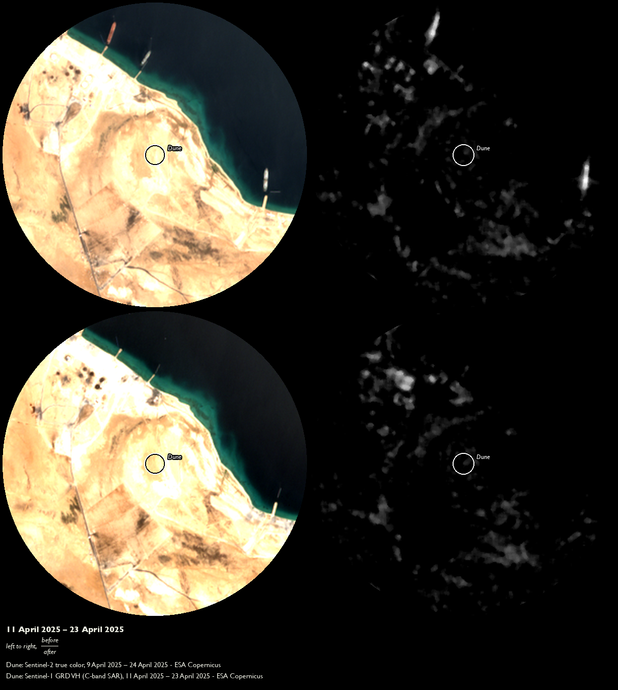

## Executive summary

By 21:41 local time on 17 April 2025, four US airstrikes arrive at the Ras Isa oil terminal. Another ten follow into the next morning [@yemeni_archive2025]. Ras Isa is targeted for bombing, claims the US Central Command, to "eliminate this source of fuel" for the armed group Ansar Allah (the Houthis): sovereign over a third of territory in Yemen, three of four of its people [@ukho_yemen_cpin2025], and a global petroleum shipping chokepoint, the strait of Bab al-Mandab. The Al Hudaydah Health Office reports 80 people are killed, 150 wounded [@yemeni_archive2025]. A figure of 74 killed, 171 wounded circulates on al-Masiryah and Saba via the Houthi Ministry of Health [@yemeni_archive2025]. In documenting the bombing's aftermath, "most of the immediate visual evidence and victim reporting was sourced from Houthi-affiliated media outlets" [@yemeni_archive2025], in which burning vehicles, orange-vested rescue personnel, and limbs severed from human bodies are clearly visible.

What, if anything, can synthetic aperture radar (SAR) tell us about the ground effects of this particular attack on Ras Isa? The 17 April attack is only the first sortie against Ras Isa. The terminal is struck again nine days later, 25–26 April, and on 2, 4, and 5 May [@yemeni_archive2025], which makes distinguishing damage from any single event more difficult. The oil terminal also presents two characteristics that confound SAR analysis, in distinct directions:

- **Vessel traffic → false positives.** A departed ship's absence reads as "damage." The tankers *Rival* and *Akoya Gas* were docked pre-strike and left within a day [@yemeni_archive2025].

- **Low-backscatter terrain → erases true positives.** Water and near-featureless ground both return weak, unstable backscatter, making near-water and bare-sand pixels almost indistinguishable from noise. This confound foils a conventional redness/cyanness damage proxy heuristic. 64.7% of the case AOI is near-water (within 100 m).

Six coordinates, corresponding to different features of Ras Isa and its surrounds, are examined for evidence of structural damage generated during the night of 17 April. Both Sentinel-1 (SAR; 12–24 April) and Sentinel-2 (optical; 9–24 April) image pairs occur strictly before the second wave of bombings on 25–26 April, in order to infer directly about the 17 April event.

{#fig-context-wide width="100%"}

## Information Environment

War-risk insurance premiums for shipping passing through conflict zones change based on specific reported incidents, like 17 April. With satellites taking between 5 and 12 days to return to a given location [@esa_sentinel1_facts; @esa_sentinel2_mission] before providing denser independent evidence on the authentic extent of structural damage, insurance estimates must rely on statements and evidence from self-interested parties intimately linked to the violent event itself.

US Central Command, for example, is unlikely to contradict Secretary of War Pete Hegseth's characterization, during a 26 March 2025 media appearance in Honolulu, Hawaii [@hegseth2025hawaii], of the "ongoing campaign against the Houthis" as "devastatingly effective." And little incentive exists for the "immediate visual evidence and victim reporting" of a party subject to aerial bombardment to disseminate reports about the people and structures *not* affected by the violence just experienced. The incentive structures between aggressor and aggrieved are not equivalent, yet in this "aftermath gap" their interpretations are by definition subjective and incomplete.

War-risk insurance is concerned with risk to commodities, not people. The salient structure at Ras Isa to evaluate the risk to petroleum as a commodity – whether or not it reaches its destination – is the white circular tanks where transiting petroleum is stored.

A well-resourced analyst can close the aftermath gap using an Automatic Identification System (AIS) ship-tracking feed and Very High Resolution (VHR) optical satellite imagery. They might cross-reference vessel movements with documented bombing records and then evaluate by eye evidence of structural damage. Applying these paid tools to the 17 April Ras Isa case costs at least USD 8,600.

What follows instead is the War-Risk Screen. It is a replicable three-step check, using entirely open Sentinel-1 and Sentinel-2 imagery, for distinguishing authentic structural damage signal from noise in marine-shipping information environments.

## What the naive scan shows

{#fig-overview width="100%"}

A simple SAR scan of backscatter changes at the terminal before and after 17 April (@fig-naive-scan) returns backscatter increases clustering inland of the northernmost quays (R1) and continuing southeast along the waterline (Quay base, Mooring point). More concentrated backscatter increases are observed at two points along the refining facility's southern wall (Dot 1, Dot 2). A sixth coordinate (Dune) was selected for investigation because of its unusual shape, evident from pre-bombing optical context (@fig-overview).

{#fig-naive-scan width="100%"}

At first blush, this initial analysis seems to generate multiple fruitful leads on which to spend time and resources. These clusters are made more appealing because they present as plausible location targets for the 17 April bombing, just inland of quays and along the refining facility structure. In fact, only one of the five naive backscatter increase clusters proves plausible: the fuel storage tanks at coordinate R1 (@fig-r1-tank).

{#fig-r1-tank width="100%"}

Three outcomes emerge from these six candidates. A moving vehicle generates a false lead, water or featureless land erases a true one, and only a site exposed to neither preserves a trustworthy signal.

{#fig-mooring-quay width="100%"}

{#fig-dune width="100%"}

- **Vehicles move → generate false leads.** Mooring point (maritime) and Dot 1/Dot 2 (wheeled, at a road junction outside the compound gate – not a reported structure) are adjacent to areas with high vehicle traffic. Vehicle presence generally returns strong backscatter. Both types of vehicles were recently absent in the post-bombing inference image isolating damage from 17 April (Dot 2: VV t = −3.07, p = 0.0235 – significant but negative; @fig-mooring-quay).
- **Low-backscatter terrains → erase true leads.** Quay base (maritime waterline) and the inland dune (bare, featureless terrain, low mean damage-proxy brightness 5.9/255) are adjacent to areas of near-zero backscatter (@fig-mooring-quay, @fig-dune). Water and bare sand generally return weak, unstable backscatter. Neither location's backscatter shift exceeds the sensor's noise floor in the post-bombing inference image.
- **Over 100 m inland → preserve trustworthy leads.** R1 (fuel storage tanks) sits 201 m from mapped water (@tbl-water), outside both the port's vehicle-traffic corridors and the AOI's near-zero-backscatter terrain. Built structures generally return strong, stable backscatter. R1's shift clears the noise floor, with both VV and VH bands returning statistically significant backscatter increases post-bombing.

| #   | AOI                            | Violence type                            | Reference and inference periods / n          | SAR reading                                                                                                   |
| --- | ------------------------------ | ---------------------------------------- | -------------------------------------------- | ------------------------------------------------------------------------------------------------------------- |
| 1.1 | R1 (fuel tank cluster)         | Airstrike/fire (reported)                | 12 mo pre / 1 mo post; ref_n = 30, inf_n = 3 | VV t = +4.33, df = 3.08, p = 0.0214; VH t = +5.46, df = 3.15, p = 0.0107                                      |
| 1.2 | Dot 1 (gate junction)          | Airstrike/fire (reported)                | 12 mo pre / 1 mo post; ref_n = 30, inf_n = 3 | VV t = −1.76, df = 2.58, p = 0.1917; VH t = −0.50, df = 2.96, p = 0.6542                                      |
| 1.3 | Dot 2 (gate junction)          | Airstrike/fire (reported)                | 12 mo pre / 1 mo post; ref_n = 30, inf_n = 3 | VV t = −3.07, df = 5.69, p = 0.0235; VH t = −1.19, df = 3.50, p = 0.3069                                      |
| 1.4 | Quay base (lower quay)         | Airstrike/fire (reported)                | 12 mo pre / 1 mo post; ref_n = 30, inf_n = 3 | VV t = +1.00, df = 3.15, p = 0.3887; VH t = +1.01, df = 3.38, p = 0.3795                                      |
| 1.5 | Inland dune (negative control) | Airstrike/fire (reported)                | n/a – not statistically tested               | Mean brightness 5.9/255 (damage-proxy VH); redness/cyanness heuristic unreliable at near-zero backscatter     |
| 1.6 | Mooring point                  | Vessel turnover (confound, not violence) | n/a – screened pre-test                      | Redness peak beside two vessel-shaped streaks; optical confirms a moored vessel present 9 Apr, gone by 24 Apr |

: Case metadata – Ras Isa oil terminal (Yemen) {#tbl-cases}

## Method

1. **Verify your anchoring AOI coordinate centers on an inland facility, not a marine transit area.** A port/terminal's listed coordinate is sometimes its offshore (on-water) anchorage. Centering here blankets the AOI in low-backscatter water, which reliably confounds SAR as discussed above. Cross-check your anchor coordinate against OSM Overpass tags (e.g., `man_made=storage_tank`, `landuse=industrial`), then run an independent distance check before starting testing. In Ras Isa, the independently-checked distance from Hodeidah is ~56 km, whereas the naive coordinate's distance is ~52 km.
2. **Scan both your optical and SAR frames for connected-component blobs.** Not just the coordinate in question. A full-frame blob scan is what surfaces a genuine candidate. The optical context shows the tank outlines at R1 lost circularity between 9 and 24 April. Subsequent SAR analysis significance per orbit/band Welch's t-test [@ballinger2025]: VV +2.38 dB, t = 4.33, p = 0.0214; VH +3.66 dB, t = 5.46, p = 0.0107; Stouffer z = 3.43, p = 0.0006.
3. **Check the optical record for a vessel before trusting a near-shore blob.** A moored-then-departed vessel produces a change blob up to ~60,000 m² along a jetty line. An eye-test for ship presence or absence on your optical before/after scenes is sufficient, no statistical test required.

## Limitations and open questions

The War-Risk Screen is designed to help infer structural damage candidates using a single before and after scene pair (n = 2). As we have seen, transient vehicle traffic amid low-backscatter terrain in either SAR scene can generate false leads while suppressing plausible structural damage signals. Analysts should collect independent post-event data before drawing conclusions from SAR imagery alone. Two additional constraints on the Screen as used in the Ras Isa case:

- **Only one SAR flight track covers AOI.** 4 ASCENDING annual scenes (ref_n = 1 inside 150 m buffer), compared to DESCENDING's 64 annual scenes.
- **Cannot confirm or reject candidates by itself.** Single track with no independent third-source corroboration cannot be decisive. That said, R1 is corroborated as a candidate, presenting a backscatter increase at p < 0.05 for both VV and VH bands. Conversely, discarded candidates (e.g., Gate junction) cannot be decisively ruled out as undamaged.

## What this means

For rapid-assessment outlets and underwriters making near-real-time decisions about maritime risk with limited information, the War-Risk Screen enables tentative vetting of shipping-related structural damage with minimal open data. For those with access to commercial VHR, it narrows candidate locations across an AOI to the ones worth a costly tasking. The objective is not that its candidates survive further scrutiny, but that this scrutiny is correctly directed.

The estimated cost for the Ras Isa case without the Screen: USD 8,609.

- **VHR.** Planet SkySat's published Assured-tasking rate is USD 40/km², 25 km² minimum order [@observationdata_tasking2025]. A 113.1 km² initial pass (USD 4,524) plus four minimum-order zoomed tasks, one per coordinate (4 × 25 km² = 100 km², USD 4,000) ≈ USD 8,524.

- **AIS.** Entry-tier commercial subscriptions start around USD 85/month (EUR 80) [@datadocked_pricing2026], often running on coastal receiver networks with thin open-water coverage. Genuine satellite-AIS access for a remote site like Ras Isa is enterprise-quote-only and not publicly priced. The total AIS cost is likely underestimated.

**The War-Risk Screen cuts the cost for the same run by 88%.** The Screen replaces a costly AOI survey pass with VHR for free, while allowing open-source verification of vessel turnover, the job AIS would otherwise do. What remains is a single confirmatory VHR tasking per surviving candidate (here, R1).

Given a 25 km² minimum order at USD 40/km², this single VHR task costs around USD 1,000.

## Appendix: Data and parameters

**Tools, Method steps 1–3.**

- **Overpass Turbo.** overpass-turbo.eu, `man_made=storage_tank`/`landuse=industrial` within ~2 km of the claimed point. Use any map tool's measure feature for the distance check.
- **Connected-component labeling.** `scipy.ndimage.label` on the damage-proxy raster's redness channel (R − (G+B)/2), full AOI.
- **Recent low-cloud Sentinel-2 true color.** Before/after, same coordinates, via Copernicus Browser or Google Earth Engine.

All three are also one CLI run of this project's own open-source pipeline (`sar_damage_assessment`, `./damage_assess.sh`).

| #   | Tested coordinate (lat, lon)                                                   | Buffer                                            | Orbit · relative orbit                                 |
| --- | ------------------------------------------------------------------------------ | ------------------------------------------------- | ------------------------------------------------------ |
| 1.1 | 15.247410, 42.616510 (OSM `man_made=storage_tank`)                             | 150 m                                             | descending · 6                                         |
| 1.2 | 15.214730, 42.648350 (`damage_proxy_vh.png` redness peak)                      | 150 m                                             | descending · 6                                         |
| 1.3 | 15.214550, 42.652460 (`damage_proxy_vh.png` redness peak)                      | 150 m                                             | descending · 6                                         |
| 1.4 | 15.234747, 42.631878 (pier shore-anchor, coordinate supplied)                  | 150 m                                             | descending · 6                                         |
| 1.5 | 15.240000, 42.621500 (box centroid, visual scan only)                          | ~2.0 km box, not 150 m                            | ascending · 116 (visual export only, not point-tested) |
| 1.6 | 15.233717, 42.639300 (`damage_proxy_vh.png` redness peak, computed 2026-09-19) | n/a – visual/optical check only, not point-tested | descending · 6                                         |

: Per-case tested coordinate, point buffer, and Sentinel-1 track {#tbl-params}

| Coordinate    | Distance to mapped water |
| ------------- | ------------------------ |
| Mooring point | 42 m                     |
| Quay base     | 60 m                     |
| R1            | 201 m                    |
| Dot 2         | 218 m                    |
| Dot 1         | 350 m                    |
| Dune          | 552 m                    |

: Distance from each tested coordinate to the nearest JRC Global Surface Water pixel (occurrence ≥ 5%) [@slagter2024]. Only Mooring point and Quay base fall inside this 100 m threshold. Dot 1, Dot 2, and the dune are well clear of mapped water, so their backscatter instability traces to general bare/featureless terrain. {#tbl-water}

## References

::: {#refs}
:::
